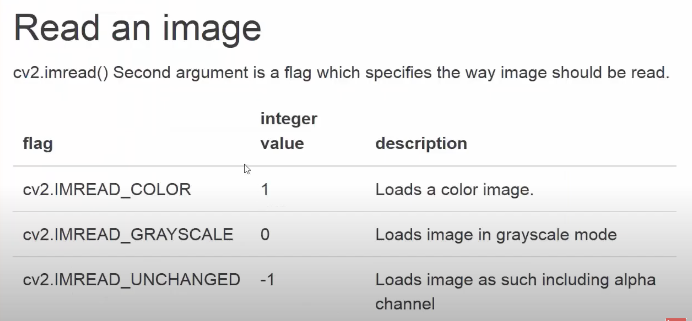
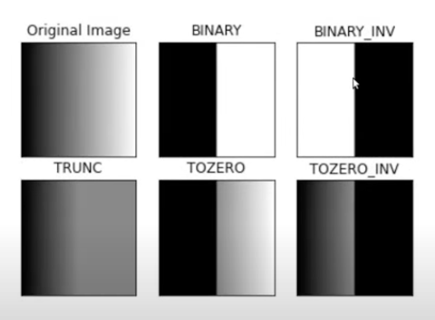
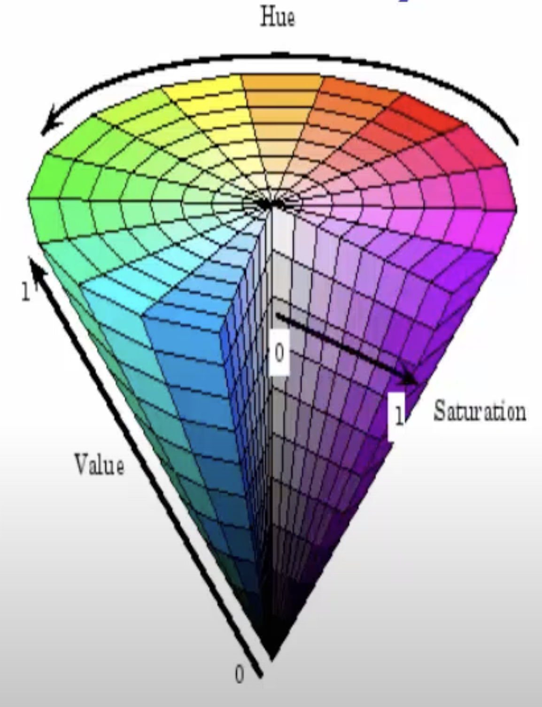

# OpenCV

## What are images?

- Images are numpy arrays.
 ```python
 import cv2

 image = cv2.imread('some_image.png')
 print(type(image))
 ```
 ```<class 'numpy.ndarry'>```

- An image shape is given by its height, width and number of channels.
 ```python
 print(image.shape)
 ```
 ```(720,1280,3)```

- An image is made by **pixels**
    - In "most cases" pixel value range from **0** to **255**.
    - In binary images, pixel value is in **[0,1]** ( or **[0,255]**).
    - In 16 bits images pixel value range from **0** to **65535**. (Generally 8 bits)

## Input/Output

- __Image__
```python
# read image
img = cv2.imread(image_path)
# write image
cv2.imwrite(image_out_path, img)
# Visualization
cv2.imshow('Bird', img)
cv2.waitKey(0)
```
The ```waitKey``` keeps the image open indefinitely untill a key is pressed.



- **Video**
```python
# read video
video = cv2.VideoCapture(video_path)
# visualize video
ret = True
while ret:
    ret, frame = video.read()
    if ret:
        cv2.imshow('Elephant', frame)
        cv2.waitKey(20)
```
Writing a video is slightly more complicated.
The ```ret``` boolean variable is ``` True``` if there is a frame that can be read else it is ```False```
The ```waitKey``` is given a number so each frame is open only for that amout of miliseconds. for 25 frames per second that number would be 40 miliseconds.

To release the memory space allocated to the video, always have the below code.
```python
video.release()
cv2.destroyAllWindows()
```

- **Webcam**
```python
# read webcam
video = cv2.VideoCapture(0)
# visualize webcam
while True:
    ret, frame = video.read()
    if ret:
        cv2.imshow('WebCam', frame)
        if cv2.waitKey(20) & 0xFF == ord('q'):
            break
```

The number in the ```VideoCapture``` is the webcam number you want to use. 

**Saving the Video/Webcam Output**
```python
w = int(webcam.get(cv2.CAP_PROP_FRAME_WIDTH))
h = int(webcam.get(cv2.CAP_PROP_FRAME_HEIGHT))

# write
fourcc = cv2.VideoWriter_fourcc(*'XVID')
output_path = os.path.join('.','data','output.avi')
out = cv2.VideoWriter(output_path, fourcc, 20.0,(w,h))

while (webcam.isOpened()):
    ret, frame = webcam.read()
    if ret:
        # grayscale
        gray = cv2.cvtColor(frame, cv2.COLOR_BGR2GRAY)
        cv2.imshow('Webcam', frame)
        out.write(gray)
        if cv2.waitKey(1) & 0xFF == ord('q'):
            break
```

## Basic Operations

- **Basic**
```python
print(f"Image shape: {img.shape}")
print(f"Image size: {img.size}")
print(f"Image data type: {img.dtype}")
```

-**Split**
```python
b, g, r = cv2.split(img)
```

-**Merge**
```python
new_img = cv2.merge((r, g, b))
```

- **Resizing**
```python
resized_img = cv2.resize(img, (640, 640))
```

- **Cropping**
```python
cropped_img = img[120:240, 120:260]
```

- ***Region of Interest***
We can select some regions on an image called "region of interest".
```python
ball = img[280:340,330:390]

img[273:333,100:160] = ball
```
The above code just selects a part of the image and puts it in another location on the same image.

We use an add function which basically calculates the per-element sum of two arrays or an array and a scalar.
```python
dst = cv2.add(img, img_2)
```
Weighted Sum:
```python
dst = cv2.addWeighted(img,0.3,img_2,0.7,0)
```

## Bitwise Operations
Very useful when working with masks. Masks are binary images that indicate the pixel in which an operation must be performed.
```python
bitAnd = cv2.bitwise_and(img2,img1)
bitOr = cv2.bitwise_or(img2, img1)
bitXOR = cv2.bitwise_xor(img2,img1)
bitNot = cv2.bitwise_not(img2)
```


## Setting Camera Parameters

For the webcam capture we can set the width and height parameters as:

```python
webcam.set(3, 1000) # width
webcam.set(4, 720) # height
```

## Colorspaces

All images loaded by OpenCV are in the **BGR** Format.

```python
img_gray = cv2.cvtColor(img, cv2.COLOR_BGR2GRAY)
img_rgb = cv2.cvtColor(img, cv2.COLOR_BGR2RGB)
img_hsv = cv2.cvtColor(img, cv2.COLOR_BGR2HSV)
```
The ```HSV``` colorspace is very popular among other colorspaces offered by openCV and have a very important application (egs. color detection) in the computer vision field.

## Blurring

Helpful to remove noise in an image.
- __blur__ : Each pixel is the mean of its kernel neighbours
- __gaussian blur__ : Convolve weach pixel with a gaussian kernel
- __median blur__ : Central element is replaced by the median of the kernel neighbours. This operation processes the edges while removing noise.

```python
k_size = 7
img_blur = cv2.blur(img, (k_size, k_size))
img_gaussian_blur = cv2.GaussianBlur(img, (k_size, k_size), 5)
img_median_blur = cv2.medianBlur(img, k_size)
```

## Threshold



We use thresholding for semantic segmentation. Thresholding is a form of segmentation technique used to seperate an object from its background.

- **Simple Thresholding** : 

    For every pixel the same threshold value is applied.

    We must first convert the color image into grayscale.

    ```python
    ret, thresh = cv2.threshold(img_gray, 80, 255, cv2.THRESH_BINARY)
    ```
    where ```80``` is the threshold we are going to use where ant pixel value above 80 will become 255(or white) and below 80 will become 0(or black) and ```255``` is the maximum value of a pixel. ```cv2.THRESH_BINARY``` is the type of threshold we apply.

    The output may not always be perfect so we just blur the resulting binary image and again send it through a threshold to get a better result.
    ```python
    thresh = cv2.blur(thresh, (10, 10))
    ret, thresh = cv2.threshold(thresh, 80, 255, cv2.THRESH_BINARY)
    ```

- **Adaptive Thresholding** : 
    Sometimes there would be shadows and highlights in an image where we cannot use just a single threshold. Hence we use the adaptive threshold.

    ```python
    adaptive_thresh = cv2.adaptiveThreshold(img_gray, 255, cv2.ADAPTIVE_THRESH_GAUSSIAN_C, cv2.THRESH_BINARY, 21, 30)
    ```
    With ```ADAPTIVE_THRESH_GAUSSIAN_C``` the adaptive method and ```THRESH_BINARY``` the threshold type. ```21``` is the block size which decides the size of the neighbourhood area and ```30``` is the constant that is used by the adaptive threshold function that is the C value.

## Edge Detection

Many types of edge detection, namely:
- Sobel Operator
- Laplacian Operator
- Canny Edge Operator
    ```python
    img_edge = cv2.Canny(img, 100, 200)
    ```
    where ```100, 200``` are the min and max threshold we send to the canny edge detector.

After edge detection you can erode or dilate the image.
- **Erode** : The pixel is turned black if there are black pixels in its neighborhood
- **Dilate** : The pixel is turned white if there are white pixels in its neighborhood

## Drawing

We'll draw using the help of OpenCV. Four most popular drawings are:
- line
    ```python
    cv2.line(img, (100, 150), (300, 450), (0, 255, 0), 3)
    ```
    - Starting point: ```(100, 150)```
    - Ending point: ```(300, 450)```
    - Color: ```(0, 255, 0)```
    - Thickness: ```3```

- rectangle
    ```python
    cv2.rectangle(img, (200, 350), (450, 600), (0, 0, 255), -1)
    ```
    - Upper left corner: ```(200, 350)```
    - Lower right corner: ```(450, 600)```
    - Color: ```((0, 0, 255)```
    - Thickness: ```-1``` this fills up the rectangle with solid color. Any positive non-zero value will give only the boundary of the rectangle.

- circle
    ```python
    cv2.circle(img, (800, 200), 75, (255, 0, 0), 10)
    ```
    - Centre point: ```(800, 200)``` x-value is associated with the width and the y-value with the height.
    - Radius: ```75```
    - Color: ```(255, 0, 0)```
    - Thickness: ```10```

- text
    ```python
    cv2.putText(img, 'Hey you!', (600, 450), cv2.FONT_HERSHEY_SIMPLEX, 2, (255, 255, 0), 10)
    ```
    - Text: ```'Hey you!'```
    - Location: ```(600, 450)```
    - Font: ```cv2.FONT_HERSHEY_SIMPLEX```
    - Text Size: ```2```
    - Color: ```(255, 255, 0)```
    - Thickness: ```10```

- Others
    - Arrowed Line : ```cv2.arrowedLine(img, (100, 150), (300, 450), (0, 255, 0), 3)```
    - Polygon
    - Ellipse

We can start off with just the numpy zeroes as a background instead of an image
```python
import numpy as np
img = np.zeros([512,512,3], np.uint8)
```
This produces a black image.

We can do the same for Videos as well.

## Contours

All the borders of the isolated white regions in an image

```python
contours, hierarchy = cv2.findContours(thresh, cv2.RETR_TREE, cv2.CHAIN_APPROX_SIMPLE)

for cnt in contours:
    if cv2.contourArea(cnt) > 200:
        # cv2.drawContours(img, cnt, -1, (0, 255, 0), 1)

        x1, y1, w, h = cv2.boundingRect(cnt)

        cv2.rectangle(img, (x1, y1), (x1 + w, y1 + h), (0, 255, 0), 2)
```
Where ```cv2.drawContours(img, cnt, -1, (0, 255, 0), 1)``` draws around such white regions 
```cv2.boundingRect(cnt)``` returns a rectangle that can contain the contours.

## Mouse Events

Some Events: **```'EVENT_FLAG_ALTKEY'```, ```'EVENT_FLAG_CTRLKEY'```, ```'EVENT_FLAG_LBUTTON'```, ```'EVENT_FLAG_MBUTTON'```, ```'EVENT_FLAG_RBUTTON'```, ```'EVENT_FLAG_SHIFTKEY'```, ```'EVENT_LBUTTONDBLCLK'```, ```'EVENT_LBUTTONDOWN'```, ```'EVENT_LBUTTONUP'```, ```'EVENT_MBUTTONDBLCLK'```,```'EVENT_MBUTTONDOWN'```, ```'EVENT_MBUTTONUP'```, ```'EVENT_MOUSEHWHEEL'```, ```'EVENT_MOUSEMOVE'```, ```'EVENT_MOUSEWHEEL'```, ```'EVENT_RBUTTONDBLCLK'```, ```'EVENT_RBUTTONDOWN'```, ```'EVENT_RBUTTONUP'```**

To invoke a function on any mouse event we use the  ```cv2.setMouseCallback('image',click_event)``` method where ```click_event``` function can be defined as the following example:
```python
def click_event(event, x, y, flags, param):
    if event == cv2.EVENT_LBUTTONDOWN:
        print(f'X: {x}, Y: {y}')
        font = cv2.FONT_HERSHEY_SIMPLEX
        text = f'({x}, {y})'
        cv2.putText(img, text, (x, y), font, 1, (255, 255, 0), 2, cv2.LINE_AA)
        cv2.imshow('image', img)
```

## Bind Trackbars to OpenCV Window

Useful whever we want to change a value in an image dynamically at run time.

- Create a named window
```python
cv2.namedWindow('image')
```
- Create a trackbar
```python
cv.createTrackbar('B', 'image', 0, 255, nothing)
```
where ```'B'``` = Trackbar name, ```'image'``` = Window name, ```0```,```255``` = Min and Max values, ```nothing``` = Function to be executed on triggering the trackbar event

- Get the trackbar values
```python
b = cv.getTrackbarPos('B', 'image')
```

## Object Detection and Object Tracking using HSV Color Space

> HSV (Hue, Saturation and Value)



- Hue corresponds to the color components(base pigment)(0-360) 
- Saturation is the amount of color(depth of the pigment)(dominance of hue)(0-100%)
- Value is basically the brightness of the color (0-100%)


```python
hsv = cv2.cvtColor(frame, cv2.COLOR_BGR2HSV)
        
l_h = cv2.getTrackbarPos('LH', 'Tracking')
l_s = cv2.getTrackbarPos('LS', 'Tracking')
l_v = cv2.getTrackbarPos('LV', 'Tracking')

u_h = cv2.getTrackbarPos('UH', 'Tracking')
u_s = cv2.getTrackbarPos('US', 'Tracking')
u_v = cv2.getTrackbarPos('UV', 'Tracking')

l_b = np.array([l_h,l_s,l_v])
u_b = np.array([u_h,u_s,u_v])

mask = cv2.inRange(hsv, l_b, u_b)

res = cv2.bitwise_and(frame, frame, mask=mask)
```

## MatPlotLib with OpenCV

- OpenCV reads the image in the ```BGR``` format while Matplotlib reads an image in the ```RGB``` format.
```python
img = cv2.cvtColor(img, cv2.COLOR_BGR2RGB)
plt.imshow(img)

plt.xticks([]), plt.yticks([])
plt.show()
```
- OpenCV image are shown in a static window wheras Matplotlib image are shown in a dynamic window.

- To plot multiple images
```python
titles = ["Original Image", "BINARY", "BINARY_INV"]
images = [img, th1, th2]

for i in range(3):
    plt.subplot(1,3, i+1)
    plt.imshow(images[i], 'gray')
    plt.title(titles[i])
    plt.xticks([]), plt.yticks([])

plt.show()
```

