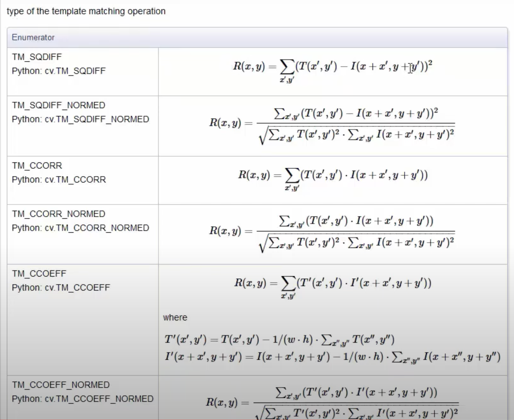

# OpenCV

## What are images?

- Images are numpy arrays.
 ```python
 import cv2

 image = cv2.imread('some_image.png')
 print(type(image))
 ```
 ```<class 'numpy.ndarry'>```

- An image shape is given by its height, width and number of channels.
 ```python
 print(image.shape)
 ```
 ```(720,1280,3)```

- An image is made by **pixels**
    - In "most cases" pixel value range from **0** to **255**.
    - In binary images, pixel value is in **[0,1]** ( or **[0,255]**).
    - In 16 bits images pixel value range from **0** to **65535**. (Generally 8 bits)

## 1. Input/Output

- __Image__
```python
# read image
img = cv2.imread(image_path)
# write image
cv2.imwrite(image_out_path, img)
# Visualization
cv2.imshow('Bird', img)
cv2.waitKey(0)
```
The ```waitKey``` keeps the image open indefinitely untill a key is pressed.


- **Video**
```python
# read video
video = cv2.VideoCapture(video_path)
# visualize video
ret = True
while ret:
    ret, frame = video.read()
    if ret:
        cv2.imshow('Elephant', frame)
        cv2.waitKey(20)
```
Writing a video is slightly more complicated.
The ```ret``` boolean variable is ``` True``` if there is a frame that can be read else it is ```False```
The ```waitKey``` is given a number so each frame is open only for that amout of miliseconds. for 25 frames per second that number would be 40 miliseconds.

To release the memory space allocated to the video, always have the below code.
```python
video.release()
cv2.destroyAllWindows()
```

- **Webcam**
```python
# read webcam
video = cv2.VideoCapture(0)
# visualize webcam
while True:
    ret, frame = video.read()
    if ret:
        cv2.imshow('WebCam', frame)
        if cv2.waitKey(20) & 0xFF == ord('q'):
            break
```

The number in the ```VideoCapture``` is the webcam number you want to use. 

**Saving the Video/Webcam Output**
```python
w = int(webcam.get(cv2.CAP_PROP_FRAME_WIDTH))
h = int(webcam.get(cv2.CAP_PROP_FRAME_HEIGHT))

# write
fourcc = cv2.VideoWriter_fourcc(*'XVID')
output_path = os.path.join('.','data','output.avi')
out = cv2.VideoWriter(output_path, fourcc, 20.0,(w,h))

while (webcam.isOpened()):
    ret, frame = webcam.read()
    if ret:
        # grayscale
        gray = cv2.cvtColor(frame, cv2.COLOR_BGR2GRAY)
        cv2.imshow('Webcam', frame)
        out.write(gray)
        if cv2.waitKey(1) & 0xFF == ord('q'):
            break
```

## 2. Basic Operations

- **Basic**
```python
print(f"Image shape: {img.shape}")
print(f"Image size: {img.size}")
print(f"Image data type: {img.dtype}")
```

- **Split**
```python
b, g, r = cv2.split(img)
```

- **Merge**
```python
new_img = cv2.merge((r, g, b))
```

- **Resizing**
```python
resized_img = cv2.resize(img, (640, 640))
```

- **Cropping**
```python
cropped_img = img[120:240, 120:260]
```

- ***Region of Interest***  
We can select some regions on an image called "region of interest".
```python
ball = img[280:340,330:390]

img[273:333,100:160] = ball
```
The above code just selects a part of the image and puts it in another location on the same image.

We use an add function which basically calculates the per-element sum of two arrays or an array and a scalar.
```python
dst = cv2.add(img, img_2)
```
Weighted Sum:
```python
dst = cv2.addWeighted(img,0.3,img_2,0.7,0)
```

### 2.1 Bitwise Operations

Very useful when working with masks. Masks are binary images that indicate the pixel in which an operation must be performed.
```python
bitAnd = cv2.bitwise_and(img2,img1)
bitOr = cv2.bitwise_or(img2, img1)
bitXOR = cv2.bitwise_xor(img2,img1)
bitNot = cv2.bitwise_not(img2)
```


### 2.2 Setting Camera Parameters

For the webcam capture we can set the width and height parameters as:

```python
webcam.set(3, 1000) # width
webcam.set(4, 720) # height
```

## 3. Colorspaces

All images loaded by OpenCV are in the **BGR** Format.

```python
img_gray = cv2.cvtColor(img, cv2.COLOR_BGR2GRAY)
img_rgb = cv2.cvtColor(img, cv2.COLOR_BGR2RGB)
img_hsv = cv2.cvtColor(img, cv2.COLOR_BGR2HSV)
```
The ```HSV``` colorspace is very popular among other colorspaces offered by openCV and have a very important application (egs. color detection) in the computer vision field.

## 4. Blurring

Helpful to remove noise in an image.
- __blur__ : Each pixel is the mean of its kernel neighbours
- __gaussian blur__ : Convolve weach pixel with a gaussian kernel
- __median blur__ : Central element is replaced by the median of the kernel neighbours. This operation processes the edges while removing noise. Effective in salt and pepper images
- __bilateral filter__ : Bilateral filter.

```python
k_size = 7
kernel = np.ones((k_size, k_size), np.float32)/(k_size * k_size)
img_filter = cv2.filter2D(img, -1, kernel)
img_blur = cv2.blur(img, (k_size, k_size))
img_gaussian_blur = cv2.GaussianBlur(img, (k_size, k_size), 5)
img_median_blur = cv2.medianBlur(img, k_size)
img_bilateral_filter = cv2.bilateralFilter(img, 9, 75, 75)
```

## 5. Threshold


We use thresholding for semantic segmentation. Thresholding is a form of segmentation technique used to seperate an object from its background.

- **Simple Thresholding** : 

    For every pixel the same threshold value is applied.

    We must first convert the color image into grayscale.

    ```python
    ret, thresh = cv2.threshold(img_gray, 80, 255, cv2.THRESH_BINARY)
    ```
    where ```80``` is the threshold we are going to use where ant pixel value above 80 will become 255(or white) and below 80 will become 0(or black) and ```255``` is the maximum value of a pixel. ```cv2.THRESH_BINARY``` is the type of threshold we apply.

    The output may not always be perfect so we just blur the resulting binary image and again send it through a threshold to get a better result.
    ```python
    thresh = cv2.blur(thresh, (10, 10))
    ret, thresh = cv2.threshold(thresh, 80, 255, cv2.THRESH_BINARY)
    ```

- **Adaptive Thresholding** : 
    Sometimes there would be shadows and highlights in an image where we cannot use just a single threshold. Hence we use the adaptive threshold.

    ```python
    adaptive_thresh = cv2.adaptiveThreshold(img_gray, 255, cv2.ADAPTIVE_THRESH_GAUSSIAN_C, cv2.THRESH_BINARY, 21, 30)
    ```
    With ```ADAPTIVE_THRESH_GAUSSIAN_C``` the adaptive method and ```THRESH_BINARY``` the threshold type. ```21``` is the block size which decides the size of the neighbourhood area and ```30``` is the constant that is used by the adaptive threshold function that is the C value.

## 6. Edge Detection

Many types of edge detection, namely:
- Sobel Operator
- Laplacian Operator
- Canny Edge Operator
    ```python
    img_edge = cv2.Canny(img, 100, 200)
    ```
    where ```100, 200``` are the min and max threshold we send to the canny edge detector.

**Canny Edge Detector** is an edge detector operator that uses a multi-stage algorithm to detect a wide range of edges in images. The algorithm is composed of 5 steps:
1. Noise Reduction
2. Gradient Calculation
3. Non-maximum suppression
4. Double Threshold
5. Edge Tracking by Hysteresis

After edge detection you can erode or dilate the image.
- **Erode** : The pixel is turned black if there are black pixels in its neighborhood
- **Dilate** : The pixel is turned white if there are white pixels in its neighborhood

### 6.1 Morphological Transformation

- Morphological transformations are some simple operations based on the image shape.
- Morphological transformations are normally performed on binary images.
- We need two things for morphological transformations. The first is the image an dthe second is the kernel.
    A Kernel tells you how to change the value of any given pixel by combining it with different amounts of the neighboring pixels.

**Dilation**
```python
kernal = np.ones((5,5), np.uint8)

dilation = cv2.dilate(mask, kernal, iterations=2)
```
**Erosion**
```python
erosion = cv2.erode(mask, kernal, iterations=2)
```
**Opening**
erosion followed by dilation
```python
opening = cv2.morphologyEx(mask, cv2.MORPH_OPEN, kernal)
```
**Closing**
dilation followed by erossion
```python
closing = cv2.morphologyEx(mask, cv2.MORPH_CLOSE, kernal)
```
**Morphological Gradient**
dilute - erode
```python
morph_gradient = cv2.morphologyEx(mask, cv2.MORPH_GRADIENT, kernal)
```
**TopHat**
img - open
```python
top_hat = cv2.morphologyEx(mask, cv2.MORPH_TOPHAT, kernal)
```

### 6.2 Image Gradient and Edge Detection

An image gradient is a directional change in the intensity or color in an image.

Gradient Methods:
- Laplacian derivatives
```python
lap = cv2.Laplacian(img, cv2.CV_64F, ksize=1)
lap = np.uint8(np.absolute(lap))
```
- SobelX method
```python
sobelx = cv2.Sobel(img, cv2.CV_64F, dx=1, dy=0)
sobelx = np.uint8(np.absolute(sobelx))
```
- SobelY method
```python
sobely = cv2.Sobel(img, cv2.CV_64F, dx=0, dy=1)
sobely = np.uint8(np.absolute(sobely))
```

## 7. Drawing

We'll draw using the help of OpenCV. Four most popular drawings are:
- line
    ```python
    cv2.line(img, (100, 150), (300, 450), (0, 255, 0), 3)
    ```
    - Starting point: ```(100, 150)```
    - Ending point: ```(300, 450)```
    - Color: ```(0, 255, 0)```
    - Thickness: ```3```

- rectangle
    ```python
    cv2.rectangle(img, (200, 350), (450, 600), (0, 0, 255), -1)
    ```
    - Upper left corner: ```(200, 350)```
    - Lower right corner: ```(450, 600)```
    - Color: ```((0, 0, 255)```
    - Thickness: ```-1``` this fills up the rectangle with solid color. Any positive non-zero value will give only the boundary of the rectangle.

- circle
    ```python
    cv2.circle(img, (800, 200), 75, (255, 0, 0), 10)
    ```
    - Centre point: ```(800, 200)``` x-value is associated with the width and the y-value with the height.
    - Radius: ```75```
    - Color: ```(255, 0, 0)```
    - Thickness: ```10```

- text
    ```python
    cv2.putText(img, 'Hey you!', (600, 450), cv2.FONT_HERSHEY_SIMPLEX, 2, (255, 255, 0), 10)
    ```
    - Text: ```'Hey you!'```
    - Location: ```(600, 450)```
    - Font: ```cv2.FONT_HERSHEY_SIMPLEX```
    - Text Size: ```2```
    - Color: ```(255, 255, 0)```
    - Thickness: ```10```

- Others
    - Arrowed Line : ```cv2.arrowedLine(img, (100, 150), (300, 450), (0, 255, 0), 3)```
    - Polygon
    - Ellipse

We can start off with just the numpy zeroes as a background instead of an image
```python
import numpy as np
img = np.zeros([512,512,3], np.uint8)
```
This produces a black image.

We can do the same for Videos as well.

## 8. Contours

All the borders of the isolated white regions in an image. A curve joining all the continuous points along the boundary which are having the same color or intensity. Contours can be used for shape analysis, object detection or object recognition.  
We use binary image to find the contours for better accuracy

```python
contours, hierarchy = cv2.findContours(thresh, cv2.RETR_TREE, cv2.CHAIN_APPROX_SIMPLE)

for cnt in contours:
    if cv2.contourArea(cnt) > 200:
        # cv2.drawContours(img, cnt, -1, (0, 255, 0), 1)

        x1, y1, w, h = cv2.boundingRect(cnt)

        cv2.rectangle(img, (x1, y1), (x1 + w, y1 + h), (0, 255, 0), 2)
```
```cv2.RETR_TREE``` = Contour MODE  
```cv2.CHAIN_APPROX_SIMPLE``` = Contour approximation method  

```contours``` is a python list of all the contours in the image. Each individual contour is a numpy array of (x,y) coordinates of boundary points of the object.
```hierarchy`` contains information about image topology


Where ```cv2.drawContours(img, cnt, -1, (0, 255, 0), 1)``` draws around such white regions 
```cv2.boundingRect(cnt)``` returns a rectangle that can contain the contours.

### 8.1 Applications Using Contours

***Motion Detection***

```python
ret, frame1 = cap.read()
ret, frame2 = cap.read()


while cap.isOpened():
    diff = cv2.absdiff(frame1, frame2)
    gray = cv2.cvtColor(diff, cv2.COLOR_BGR2GRAY)
    blur = cv2.GaussianBlur(gray, (5,5), 0)
    _, thresh = cv2.threshold(blur, 20, 255, cv2.THRESH_BINARY)
    dilated = cv2.dilate(thresh, None, iterations=3)
    contours, _ = cv2.findContours(dilated, cv2.RETR_TREE, cv2.CHAIN_APPROX_SIMPLE)
    for cnt in contours:
        x, y, w, h = cv2.boundingRect(cnt)
        if cv2.contourArea(cnt)<5000:
            continue
        cv2.rectangle(frame1, (x, y), (x+w, y+h), (0, 255, 0), 2)
        cv2.putText(frame1, f"Status : {"Movement"}", (10, 20), cv2.FONT_HERSHEY_SIMPLEX, 1, (0, 0, 255), 2)
    cv2.imshow("feed", frame1)

    # Replacing the frame1 and frame2
    frame1 = frame2
    ret, frame2 = cap.read()
    if not ret:
        break
    
    if cv2.waitKey(10) == 27:
        break
```

***Shape Detection***
```python
for cnt in contours:
    # get the polygon curve
    approx = cv2.approxPolyDP(cnt, 0.01 * cv2.arcLength(cnt, True), True)
    cv2.drawContours(img, [approx], 0, (0, 0, 0), 5)
    
    # print the shape name hence get the x and y coordinates
    x = approx.ravel()[0]
    y = approx.ravel()[1]

    # determine shape by number of sides
    if len(approx) == 3:
        cv2.putText(img, "Triangle", (x, y), cv2.FONT_HERSHEY_COMPLEX, 0.5, (0, 0, 0))
    elif len(approx) == 4:
        x, y, w, h = cv2.boundingRect(approx)
        aspect_ratio = float(w) / h
        if aspect_ratio >= 0.95 and aspect_ratio <= 1.05:
            cv2.putText(img, "Square", (x, y), cv2.FONT_HERSHEY_COMPLEX, 0.5, (0,0,0))
        else:
            cv2.putText(img, "Rectangle", (x, y), cv2.FONT_HERSHEY_COMPLEX, 0.5, ( 0,0,0))
    elif len(approx) == 5:
        cv2.putText(img, "Pentagon", (x, y), cv2.FONT_HERSHEY_COMPLEX, 0.5, (0, 0, 0))
    elif len(approx) == 10:
        cv2.putText(img, "Star", (x, y), cv2.FONT_HERSHEY_COMPLEX, 0.5, (0, 0, 0))
    else:
        cv2.putText(img, "Circle", (x, y), cv2.FONT_HERSHEY_COMPLEX, 0.5, (0, 0, 0))
```


## 9. Mouse Events

Some Events: **```'EVENT_FLAG_ALTKEY'```, ```'EVENT_FLAG_CTRLKEY'```, ```'EVENT_FLAG_LBUTTON'```, ```'EVENT_FLAG_MBUTTON'```, ```'EVENT_FLAG_RBUTTON'```, ```'EVENT_FLAG_SHIFTKEY'```, ```'EVENT_LBUTTONDBLCLK'```, ```'EVENT_LBUTTONDOWN'```, ```'EVENT_LBUTTONUP'```, ```'EVENT_MBUTTONDBLCLK'```,```'EVENT_MBUTTONDOWN'```, ```'EVENT_MBUTTONUP'```, ```'EVENT_MOUSEHWHEEL'```, ```'EVENT_MOUSEMOVE'```, ```'EVENT_MOUSEWHEEL'```, ```'EVENT_RBUTTONDBLCLK'```, ```'EVENT_RBUTTONDOWN'```, ```'EVENT_RBUTTONUP'```**

To invoke a function on any mouse event we use the  ```cv2.setMouseCallback('image',click_event)``` method where ```click_event``` function can be defined as the following example:
```python
def click_event(event, x, y, flags, param):
    if event == cv2.EVENT_LBUTTONDOWN:
        print(f'X: {x}, Y: {y}')
        font = cv2.FONT_HERSHEY_SIMPLEX
        text = f'({x}, {y})'
        cv2.putText(img, text, (x, y), font, 1, (255, 255, 0), 2, cv2.LINE_AA)
        cv2.imshow('image', img)
```

## 10. Bind Trackbars to OpenCV Window

Useful whever we want to change a value in an image dynamically at run time.

- Create a named window
```python
cv2.namedWindow('image')
```
- Create a trackbar
```python
cv.createTrackbar('B', 'image', 0, 255, nothing)
```
where ```'B'``` = Trackbar name, ```'image'``` = Window name, ```0```,```255``` = Min and Max values, ```nothing``` = Function to be executed on triggering the trackbar event

- Get the trackbar values
```python
b = cv.getTrackbarPos('B', 'image')
```

## 11. Object Detection and Object Tracking using HSV Color Space

> HSV (Hue, Saturation and Value)


- Hue corresponds to the color components(base pigment)(0-360) 
- Saturation is the amount of color(depth of the pigment)(dominance of hue)(0-100%)
- Value is basically the brightness of the color (0-100%)


```python
hsv = cv2.cvtColor(frame, cv2.COLOR_BGR2HSV)
        
l_h = cv2.getTrackbarPos('LH', 'Tracking')
l_s = cv2.getTrackbarPos('LS', 'Tracking')
l_v = cv2.getTrackbarPos('LV', 'Tracking')

u_h = cv2.getTrackbarPos('UH', 'Tracking')
u_s = cv2.getTrackbarPos('US', 'Tracking')
u_v = cv2.getTrackbarPos('UV', 'Tracking')

l_b = np.array([l_h,l_s,l_v])
u_b = np.array([u_h,u_s,u_v])

mask = cv2.inRange(hsv, l_b, u_b)

res = cv2.bitwise_and(frame, frame, mask=mask)
```

## 12. MatPlotLib with OpenCV

- OpenCV reads the image in the ```BGR``` format while Matplotlib reads an image in the ```RGB``` format.
```python
img = cv2.cvtColor(img, cv2.COLOR_BGR2RGB)
plt.imshow(img)

plt.xticks([]), plt.yticks([])
plt.show()
```
- OpenCV image are shown in a static window wheras Matplotlib image are shown in a dynamic window.

- To plot multiple images
```python
titles = ["Original Image", "BINARY", "BINARY_INV"]
images = [img, th1, th2]

for i in range(3):
    plt.subplot(1,3, i+1)
    plt.imshow(images[i], 'gray')
    plt.title(titles[i])
    plt.xticks([]), plt.yticks([])

plt.show()
```

## 13. Image Pyramids

Till now we have used images of constant size. But sometimes we need to work with images of different resolutions. For example, i want to search faces in images but the faces are of different sizes or resolution.  
Pyramid or pyramid representation, is a type of multi-scale signal representation in which a signal or an image is subject to repeated smoothing and subsmapling.


There are two types of image pyramids available in OpenCV:
1. Gaussian Pyramid: 
- ```pyrDown```
- ```pyrUp```
2. Laplacian Pyramid:  
A level in Laplacian pyramid is formed by the difference between that level in gaussian Pyramid and expandded version of its upper level in Gaussian Pyramid.  


```python
layer = img.copy()
gaussian_pyramid = [layer]

for i in range(6):
    layer = cv2.pyrDown(layer)
    gaussian_pyramid.append(layer)

layer = gaussian_pyramid[-1]
cv2.imshow("upper level Gaussian pyramid", layer)

laplacian_pyramid = [layer]

for i in range(5, 0, -1):
    gaussian_extended = cv2.pyrUp(gaussian_pyramid[i])
    laplacian = cv2.subtract(gaussian_pyramid[i - 1], gaussian_extended)
    cv2.imshow(str(i), laplacian)
```

### 13.1 Image Blending: Application of Image Pyramid

1. Load the two images of apple and orange
2. Find the Gaussian Pyramids for apple and orange (in the given example, number of levels = 6)
3. From Gaussian Pyramids, find their Laplacian Pyramids
4. Join the left half of apple and right half of orange in each level of Laplacian Pyramids
5. From this joint image pyramids, reconstruct the original image

```python
# Add left and right halves of images in each level

apple_orange_pyramid = []
n = 0
for apple_lap, orange_lap in zip(lp_apple, lp_orange):
    n += 1
    cols, rows, ch = apple_lap.shape
    laplacian_combined = np.hstack((apple_lap[:, 0:int(cols/2)], orange_lap[:, int(cols/2):]))
    apple_orange_pyramid.append(laplacian_combined)

# Reconstruct the image

apple_orange_reconstruct = apple_orange_pyramid[0].copy()
for i in range(1, num_levels):
    apple_orange_reconstruct = cv2.pyrUp(apple_orange_reconstruct)
    apple_orange_reconstruct = cv2.add(apple_orange_pyramid[i], apple_orange_reconstruct)
```

## 14. Understanding Image Histograms

Histogram is a graph or a plot that gives an overall idea of the intensity distribution of an image.

- **Using Matplotlib**

```python
plt.hist(b.ravel(), 256, [0, 256])
plt.hist(g.ravel(), 256, [0, 256])
plt.hist(r.ravel(), 256, [0, 256])
plt.show()
```

- **OpenCV**

```python
hist = cv.calcHist([img],[0], mask=None, histSize=[256], ranges=[0,256])
plt.plot(hist)
plt.show()
```

Histogram can tell us whether the image has been properly exposed, whether the lighting conditions were flat or harsh,etc.

## 15. Template Matching

Method of searching and finding the location of a template image inside a larger image.



```python
res = cv2.matchTemplate(gray_img, template, cv2.TM_CCOEFF_NORMED)
print(np.max(res))

threshold = 0.9
loc = np.where(res >= threshold)
print(loc)

w, h = template.shape[::-1] # column and row value in reverse order
for pt in zip(*loc[::-1]):
    cv2.rectangle(img, pt, (pt[0] + w, pt[1] + h), (0, 0, 255), 2)
```
Every method will give different results.